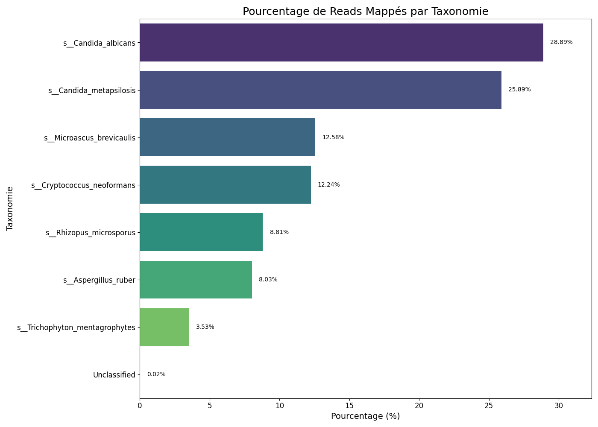
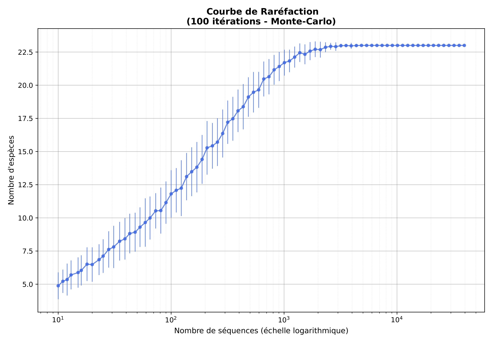

# MushContig

<div align="center">
  <a href="[[https://github.com/YoanLaforgue/MushContig/blob/main/imgs/logo_mushcontig.png]">
    
  </a>
  <br><br>
</div>

> `MushContig` est une méthodologie conçue pour surmonter les défis de l'identification fongique dans des échantillons complexes. En se concentrant sur le long fragment 18S-ITS-LSU, ce pipeline offre une résolution taxonomique supérieure à celle des approches standards basées uniquement sur l'étude du gène 18S.

Développé dans un cadre clinique, il vise à fournir un diagnostic rapide et précis, offrant une alternative à la culture fongique traditionnelle, notamment pour les échantillons poly-fongiques.

---

## Contexte

Le règne fongique reste l'un des règnes du vivant les moins caractérisés sur le plan génomique. Les bases de données publiques, bien que vastes, manquent souvent de génomes complets, se limitant principalement à des marqueurs courts comme la région 18S. Cette limite pose un problème majeur : la faible distance génétique entre certaines espèces fongiques proches rend leur distinction difficile sur la base de ce seul marqueur.

Pour pallier ces limites, `MushContig` exploite la technologie long-read **(Oxford Nanopore Texhnologies)** pour séquencer sans fragmentation un fragment incluant :
*   **18S rRNA**
*   **ITS (Internal Transcribed Spacer)** 
*   **LSU (Large Subunit) rRNA** 

---

## Prérequis

*   **Système d'exploitation** : Linux/Unix (shell `Bash`).
*   **Outils principaux** :
    *   `kraken2` (v2.1.2)
    *   `nanoplot` (v1.42.0)
    *   `porechop` (v0.2.3, avec SeqAn 2.1.1)
    *   `nanofilt` (v2.7.1)
    *   `bbmap` (v39.00)
    *   `medaka` (v1.11.3)
    *   `minimap2` (v2.28)
    *   `samtools` (v1.15)
    *   `amplicon_sorter` (v2025/05/28)
    *   `python` (v3.9)
    *   Packages : `edlib`, `biopython`, `matplotlib`
*   **Scripts .py** :
    *   `rename_fasta_with_taxid.py` : Renomme les contigs FASTA selon leur taxonomie.
    *   `base_accuracy_calculator.py` : Calcule le taux d'erreur par base à partir de la qualité médiane des reads.
    *   `plot.py` : Génère des graphiques à barres à partir des fichiers d'alignement.

---

## Tutoriel

Note : Les variables (`$path/...` , `$nb_threads`, `$numBarcode`) doivent être adaptés à votre configuration locale.

Les données de séquençage utilisées pour ce tutoriel sont disponibles sur Zenodo : [18S-ITS-LSU ONT DATA](https://zenodo.org/records/18641902)

### Étape 1 : Contrôle qualité initial (QC)

Évaluation de la qualité globale du run de séquençage.

```bash
NanoPlot -t "$nb_threads" \
        --fastq "$path/to/your/fastq/$numBarcode.fastq" \
        --title "${dateSeq}_${numBarcode}_QC" \
        --outdir "$path/to/output/nanoplot_report" \
        --maxlength 10000 \
        --plots dot
```

### Étape 2 : Déplétion humaine

Selon la nature de certains prélèvements cliniques, on observe parfois une population de reads humaines trop importante. C’est pourquoi il est nécessaire de réaliser une déplétion humaine informatisée.

Base de données recommandée : [Human database](https://zenodo.org/records/8339700)

```bash
kraken2 --threads "$nb_threads" --db "$path/to/human_data_base" --confidence 0.1 \
     --report "$path/to/output/report_human_depletion.txt" --use-names --output "$path/to/output.txt" \
     --classified-out "$path/to/output/human_reads.fastq" --unclassified-out "$path/to/output/unclassified_reads.fastq" \
     "$path/to/your/fastq/$numBarcode.fastq"
```
Les *reads* non classifiés (`Unclassified_non_human.fastq`) correspondent aux séquences non humaines qui seront utilisées pour la suite de l'analyse.

### Étape 3 : Suppression des adaptateurs

Utilisation de `porechop` pour supprimer les séquences d'adaptateurs résiduelles.

```bash
porechop -i "$path/to/your/fastq/unclassified_reads.fastq" -o "$path/to/output/unclassified_reads_adapter_trim.fastq"
```

### Étape 4 : Filtrage sur la qualité & taille

La région étudiée mesure environ **2 700 pb**. Nous appliquons donc un filtrage par taille afin de conserver les reads compris entre 2 300 et 3 000 pb, des valeurs qui peuvent être ajustées si nécessaire.

```bash
NanoFilt "$path/to/your/fastq/unclassified_reads_adapter_trim.fastq" -q 15 --headcrop 10 --tailcrop 10 \
         --length 2300 --maxlength 3000 > "$path/to/output/$numBarcode.Q15.fastq"
```


### Étape 5 : Contrôle qualité post-filtrage (QC)

Un second passage via `NanoPlot` permet de vérifier le nombre de reads restants, le N50 et la **Median read quality**.

### Étape 6 : Assemblage des contigs

Pour réaliser l’assemblage, nous utilisons `Amplicon_sorter`, un outil développé pour trier les séquences selon leur similarité et leur longueur pour générer des contigs robustes.

```bash
python3 amplicon_sorter.py -i "$path/to/your/fastq/$numBarcode.Q15.fastq" -maxr 30000 -ldc 20 \
        -sc $base_Accuracy -o "$path/to/output_folder/amplicon_sorter_output" -np $nb_threads
```

`-maxr` ou `--maxreads` :
Définit le nombre maximal de reads utilisés en entrée.
Amplicon_sorter étant relativement coûteux en temps de calcul, cette limitation permet de réduire la durée d’exécution. La pertinence de cette valeur peut être validée à l’aide d’une courbe de raréfaction.

'-sc' ou `--similar_consensus` : 
Correspond au seuil de similarité requis pour fusionner des groupes de reads pour générer une séquence consensus.
Ce paramètre est ajusté en fonction de la qualité médiane des reads (Median read quality). La valeur est extraite du fichier texte généré par NanoPlot, puis convertie en taux d’erreur par base, afin d’obtenir un seuil de similarité cohérent avec la qualité des données du run.

### Étape 7 : Identification

L’identification des séquences est réalisée à l’aide de l'outil `VSEARCH`, qui permet d’effectuer des recherches de similarité contre plusieurs bases de données.

```bash
vsearch --usearch_global "$path/to/your/fasta/$input_contigs" --db "$path/to/$ITS_DB" --id 0.98 \
        --strand both --maxaccepts 1 --maxrejects 0 \
        --userfields query+target+id+alnlen+qcov --blast6out "$path/to/output/$VSEARCH_OUT"
```

L'identification des espèces demeure l'un des défis majeurs en métagénomique fongique. Pour surmonter les limites des bases de données (références manquantes, taxonomie incomplète), nous adoptons une **approche d'identification multiple** en comparant nos consensus finaux à plusieurs bases de données de référence :

  - `NCBI nt`
  - `MycoBank`
  - `SILVA LSU 99%`
  - `Unite 99% (v.7.2)`
  - `Unite dynamic (v.9.0)`

Cette stratégie permet d'affiner le diagnostic et de se rapprocher au mieux de la réalité biologique de l'échantillon. Les *contigs* sont finalement renommés avec l'identification taxonomique la plus probable avec le script python `rename_fasta_with_taxid.py`.


### Étape 8 : Tableau d'abondance

L'abondance de chaque espèce est estimée par le ré-alignement des reads initiaux sur les contigs finaux avec `Minimap2`.

```bash
# Alignement et conversion au format BAM
minimap2 -ax map-ont -t $nb_threads "$path/to/your/fasta/$input_contigs" "$path/to/your/fastq/$numBarcode.Q15.fastq" | \
samtools sort -@ 32 -o "sorted.bam" -

# Extraction des alignements primaires et statistiques
samtools view -b -F 2304 -@ $nb_threads "sorted.bam" > "primary.sorted.bam"
samtools idxstats "primary.sorted.bam" > "$path/to/output/abundance_table.txt"
```
Exemple :

<div align="center">
  
  <br><br>
  </div>

<br>

<div align="center">
  
  <br><br>
  </div>

<br>

---

## Perspectives

Il est fort à parier que le principal défi pour la mycologie au cours de la prochaine décennie sera le séquençage d’un large panel de champignons, dans le but de constituer des bases de données plus robustes et représentatives de la diversité fongique.
Pour l’heure, une approche dite de novo, sans biais dans la reconstruction génomique, couplée à une comparaison des séquences sur différentes bases de données, constitue une alternative pertinente. Bien qu’imparfaite, cette méthode présente une fiabilité supérieure à celle reposant uniquement sur l’identification de la région 18S, laquelle ne permet généralement pas une identification au niveau de l’espèce.

`MushContig` s’inscrit dans une niche en analysant la région 18S–ITS–LSU, répondant ainsi à une demande clinique spécifique.

La `communauté Nanopore` est particulièrement active et propose régulièrement des outils bio-informatiques innovants. Par ailleurs, les progrès rapides du basecalling dans ce domaine, ainsi que l’émergence d’outils de correction de lectures (read correction), tendent à rapprocher la qualité des données `ONT` de celle obtenue avec la technologie `Illumina`.

---

## Poster

<table border="0">
  <tr>
    <td width="40%" valign="top">
      <a href="poster/Poster_Microbes_2025.jpg" target="_blank">
        
      </a>
    </td>
    <td width="60%" valign="top">
      <h2> Microbes 2025</h2>
      <p> Ce projet a été présenté par M. Poidras Étienne lors du concours Microbes 2025, organisé dans le cadre du 20ᵉ Congrès national de la Société Française de Microbiologie (SFM), qui s'est tenu au Palais des Congrès de Bordeaux du 24 au 26 septembre 2025.</p>
      <p> </p>
      <p> <a href="poster/Poster_Microbes_2025.jpg" target="_blank">Voir le poster en haute résolution</a></p>
    </td>
  </tr>
</table>
